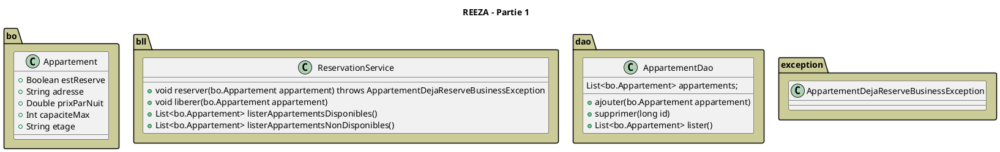

# Outil de réservation en ligne

## Réserver un appartement

### Description

Le programme doit permettre de :

* réserver un appartement pour X personne(s),
* libérer un appartement,
* lister tous les appartements disponibles à la location,
* lister les appartements déjà réservés

Un appartement possède :

* un prix de location par nuit,
* une adresse
* un nombre maximum de personnes qui peuvent y séjourner
* un étage (dans l'immeuble)

### Règles de gestion

> Un appartement qui est reséservé ne peut plus être réservé à nouveau

### Objectifs

* Créer les classes permettant d'éffectuer une réservation
* Tester votre modèle afin de valider les règles de gestion

> Combien allez-vous créer de package ?

### Proposition de diagramme de classes

voir [https://www.planttext.com](https://www.planttext.com/)



## Réserver un appartement, partie 2
```
- Ah! J'avais oublié! Quand je dis appartement ça veut dire aussi maison et péniche bien sûr
- Euh, oui, bien sûr...
```

### Description

Le programme doit aussi permettre de :

* réserver une maison
* réserver une péniche

* une maison n'a pas d'étage d'immeuble
* une maison dispose ou non d'un jardin
* une péniche dispose d'une longueur

Les opérations que l'on peut faire sur un appartement doivent pouvoir être faites sur les maisons et les péniches
également.

### Règles de gestion
Les règles de réservation sont les mêmes pour les péniches, les maisons et les appartements.

### Objectifs
* Créer les classes permettant d'éffectuer une réservation d'une péniche, d'une maison et d'un appartement
* Tester votre modèle afin de valider les règles de gestion

